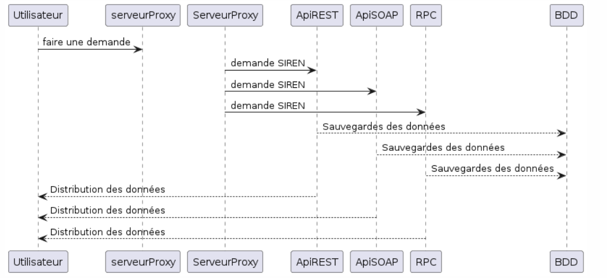

# SOA

Pour ce cours, nous devons créer une API REST, une API SOAP et un RPC afin de pouvoir retourner des informations de l'index EgaPro. Tout cela passera via un serveur proxy.

1. Serveur Proxy : Un serveur proxy est un système ou un routeur qui fournit une passerelle entre les utilisateurs et Internet de façon à rediriger différents types de requêtes sans que ce ne soit visible depuis internet.
2. API REST : une architecture logicielle qui impose des conditions sur la façon dont une API doit fonctionner.
3. API SOAP : des API qui utilisent uniquement le protocole SOAP
4. RPC : un protocole qu'un programme peut utiliser pour solliciter un service

Pour ceci, nous avons fait un diagramme de séquence qui est trouvable ci-dessous.

By Randy, Théo, Ghislain, Paul.
