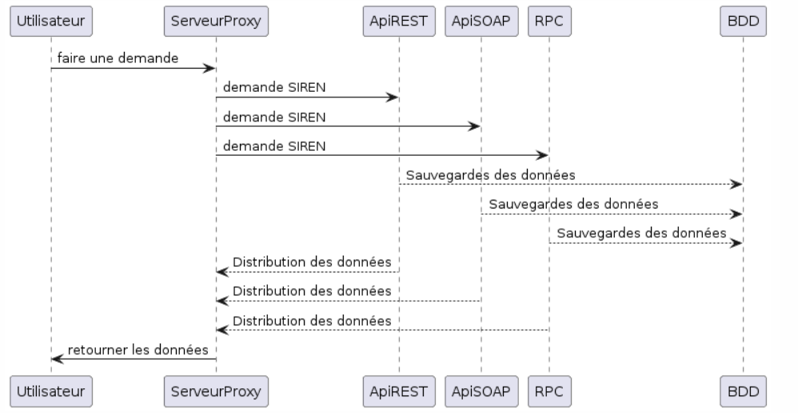

# SOA

Pour ce cours, nous devons crée une API REST et une API SOAP et RPC afin de pouvoir retourner des informations de l'index EgaPro.

1. Serveur Proxy : Un serveur proxy est un système ou un routeur qui fournit une passerelle entre les utilisateurs et Internet.
2. API REST : est une architecture logicielle qui impose des conditions sur la façon dont une API doit fonctionner.
3. API SOAP : sont des API qui utilisent uniquement le protocole SOAP.
4. RPC : est un protocole qu'un programme peut utiliser pour solliciter un service.

Pour ceci, nous avons fais un diagramme de séquence qui est ci-dessous.

La machine virtuelle n'a pas pu être configurée à temps.

By Randy, Théo, Ghislain, Paul.
